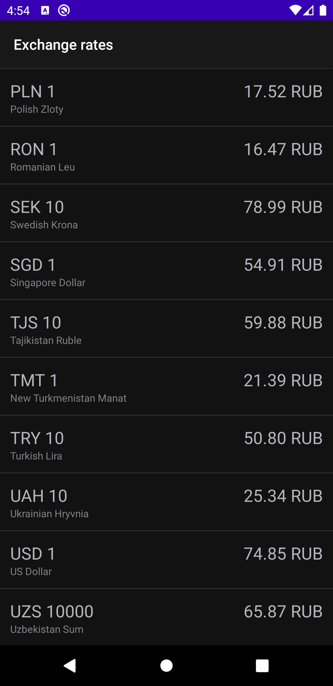
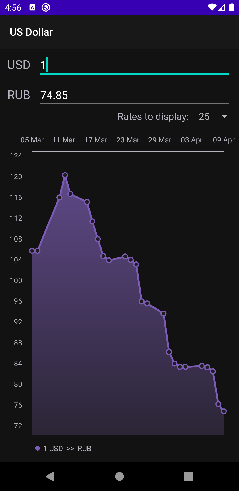
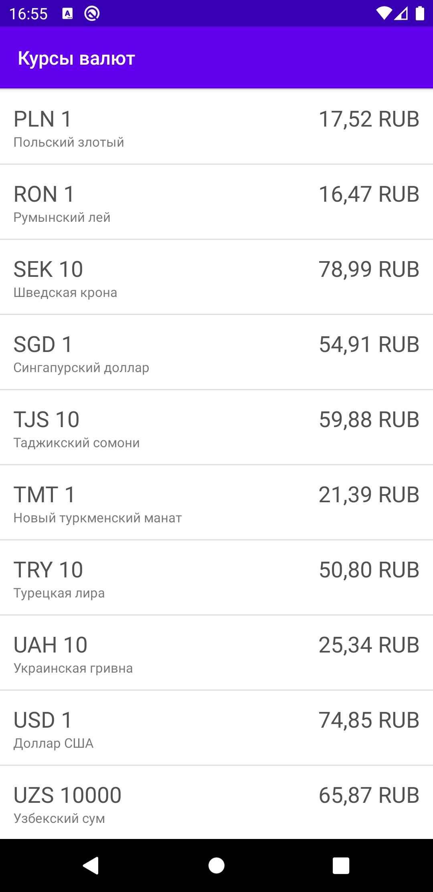
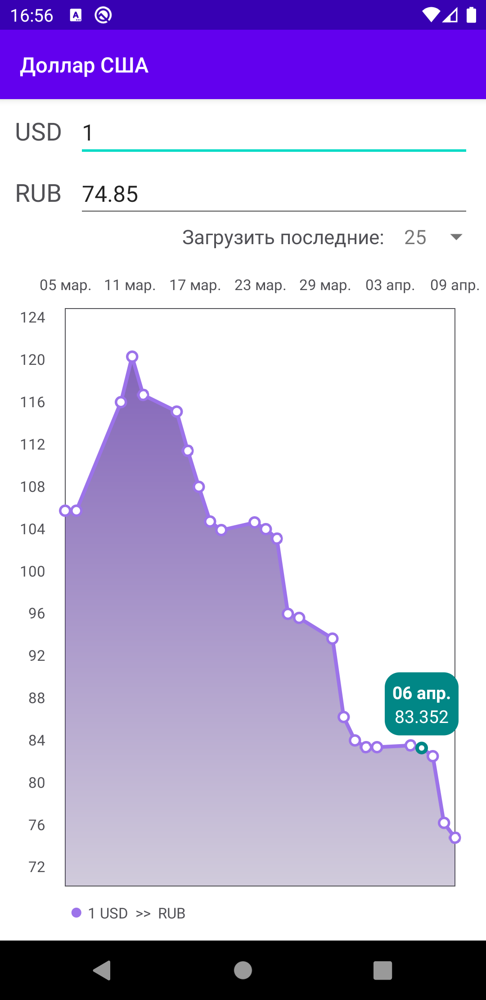

# ShiftEntranceProject
Тестовое задание от ЦФТ

 
 

## Библиотеки:

### Основные
- Kotlin Coroutines
- Room
- Retrofit
- Gson
- Hilt
- ViewModel
- LiveData
- ViewBinding
- MPAndroidChart

### Для тестирования
- Mockk
- JUnit5
- CoroutinesTest
- Turbine
- MockWebServer
- Kaspresso (Благослави боже команду из лаборатории Касперского)
- AndroidXTest
